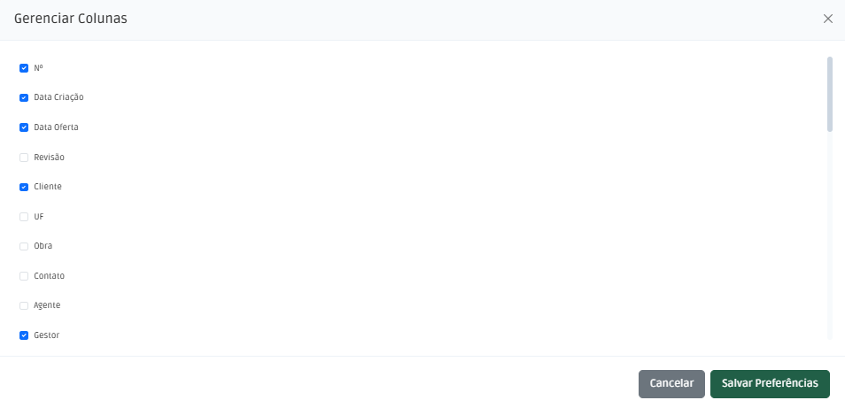
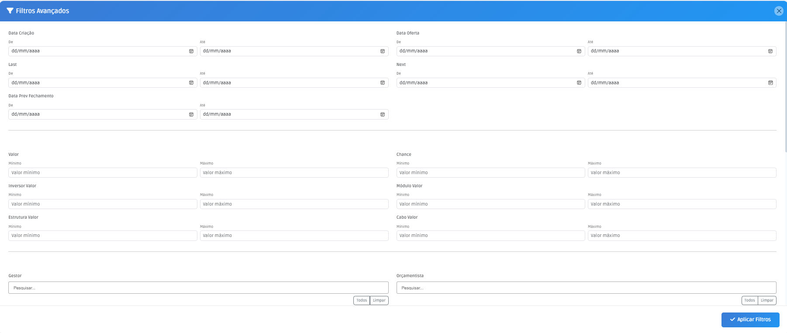

# Consulta de Propostas

## Funcionalidades

A tela principal de propostas é a tela de consulta. Nela é possível realizar diversas ações, como:

- Configurar colunas para visualizações, por meio do botão "Configurar Colunas" selecione quais colunas devem ser exibidas na tela. Esta configuração é salva para o usuário logado.

- Configurar filtros, por meio do botão "Configurar Filtros" selecione quais filtros devem ser exibidos na tela. Esta configuração é salva para o usuário logado.

- Limpar Filtros: Limpa todos os filtros aplicados. Não é salvo nas preferências do usuário. Para limpar os filtros salvos deve-se abrir a tela de filtros e desmarcar todos os filtros.
- Nova Proposta: Abre a tela de cadastro de proposta.
- Gerenciar Clientes e Contatos: Abre a tela de gerenciamento de clientes e contatos.
- Card Total de Propostas: Exibe o total de propostas cadastradas.
- Card Valor Total de Propostas: Exibe o valor total de propostas cadastradas.
- Pesquisar: É um campo de pesquisa acima da tabela que permite buscar por nome, código ou número da proposta.
- Legenda: Aponta em cores qual estágio da proposta.
- Tela de Ações: Ao clicar na linha da tabela, abre a tela de ações. Nesta tela é possível realizar diversas ações, como:
 - Editar: Abre a tela de edição de proposta.
 - Revisar: Abre a tela de revisão de proposta.
 - Follows: Abre a tela de gerenciamento de follows.

### Tópicos Relacionados
- [Cadastro de Propostas, Cliente e Contato](cadastro.md)
- [Revisão de Propostas](revisao.md)
- [Follows](follow.md)

