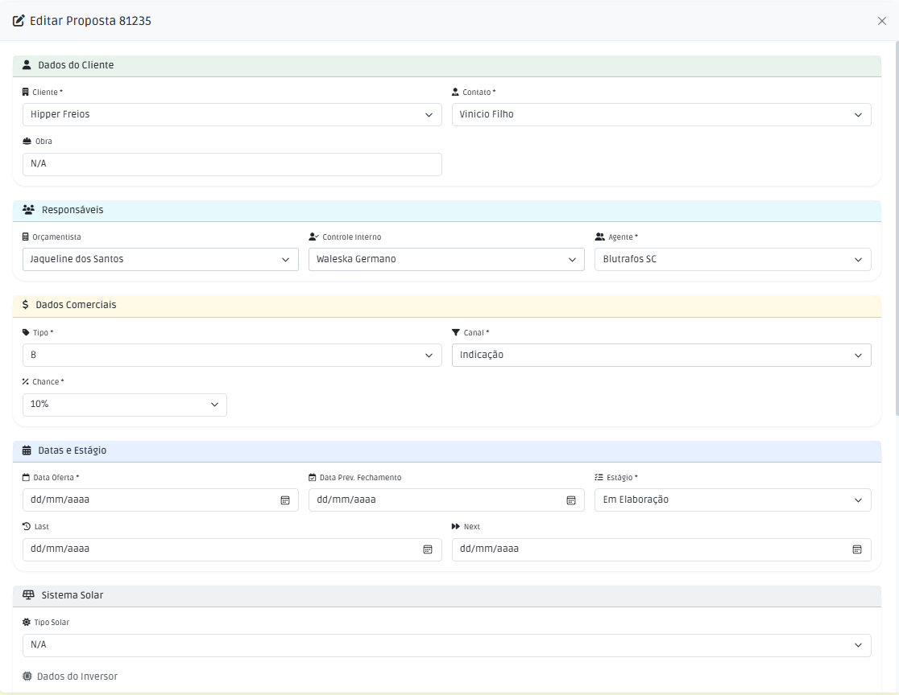

# Edição de Propostas

Esta seção descreve como modificar informações de propostas que já foram cadastradas no sistema.

## Principais Campos e Parâmetros:

| Campo | Descrição |
|-------|-----------|
|Cliente | Nome do cliente (empresa)|
| Contato | Nome do contato (pessoa física)|
|Obra| Nome da obra|
|Orçamentista| Nome do orçamentista responsável pela elaboração da proposta e envio|
|Controle Interno| Nome do controle interno responsável pela gestão e acompanhamento da proposta|
|Agente| Nome do agente responsável pela comercialização da proposta|
|Tipo| Tipo predominante do produto ofertado|
|Canal| Canal de marketing da proposta|
|Chance| Probabilidade de fechamento da proposta|
|Data da Oferta| Data do envio da proposta|
|Data Prev de Fechamento| Data prevista para fechamento da proposta|
|Estágio| Etapa atual da proposta|
|Last| Data da última atualização da proposta|
|Next | Data da próxima atualização da proposta|

!!! Obs: Os campos de valor e escopo só poderão ser alterados atráves da rotina de revisão.

## Rotina de Edição

Normalmente, você acessará a tela de edição a partir da lista principal de propostas,conforme a imagem acima. Localize a proposta que deseja alterar e clique na linha. Com esta ação abrirá a tela de ações, conforme a imagem abaixo.

A tela de edição apresentará os mesmos campos da tela de cadastro, porém já preenchidos com as informações atuais da proposta selecionada.

 

Após a edição apenas clique no botão de salvar para concluir a edição.

!!! Regras:
Quando o estágio da proposta está em "P/ Fechamento" é obrigatório incluir a data prevista de fechamento.
Para mudar do estágio "Cliente Concorrendo" é obrigatório informar a data da oferta.
!!!

