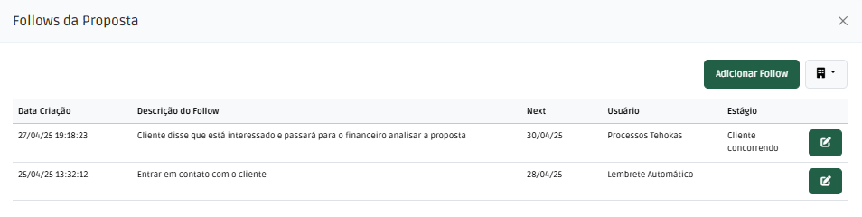
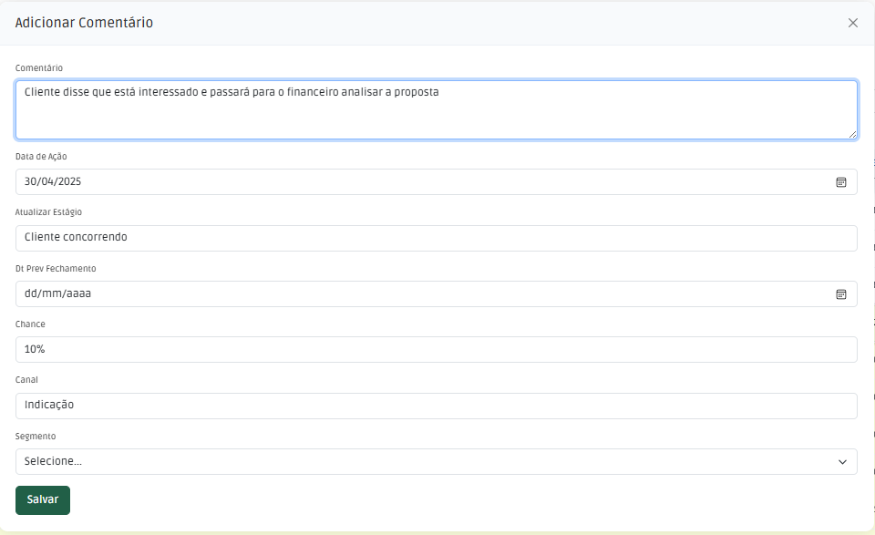
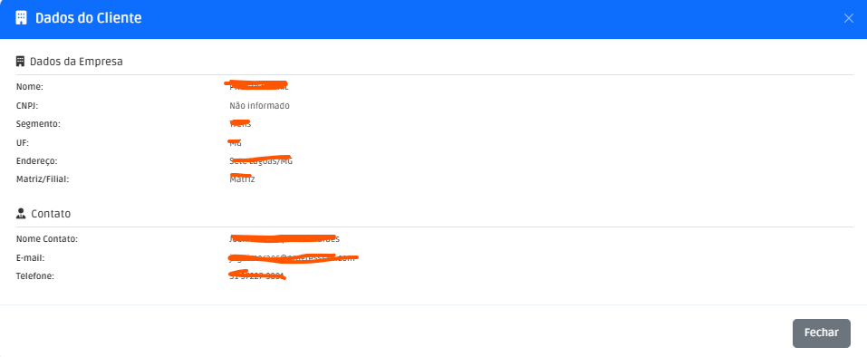

# Follows 

Os Follows são os contatos com o cliente que estão sendo seguidos pelo time de vendas.

## Principais Campos e Parâmetros:

| Campo | Descrição |
|-------|-----------|
|Data da Criação| Data de criação do follow|
|Descrição do Follow| Descrição do follow|
|Next| Data de próximo contato|
|Usuário| Usuário responsável pelo follow|
|Estágio| Log da mudança de estágio|

### Cadastro de Follow

Na tela principal de propostas, clique na linha e abra a tela de ações, selecione a opção "Follow". Após isto abrirá a listagem de follows, clique na opção "Adicionar Follow".
Ao abrir a tela de novo follow, preencha os campos e clique em salvar. Ao salvar o sistema irá atualizar a data de next e last da proposta.
Por meio desta data é possível calcular o status, seja ele "No Prazo" ou "Atrasado". Esta métrica é importante para acompanhar o andamento das propostas.

## Tela de Informações do Cliente
Na tela de listagem de follows ao lado de "Adicionar Follow" há um botão que ao clicado leva a tela com as principais informações do cliente. Conforme abaixo:

