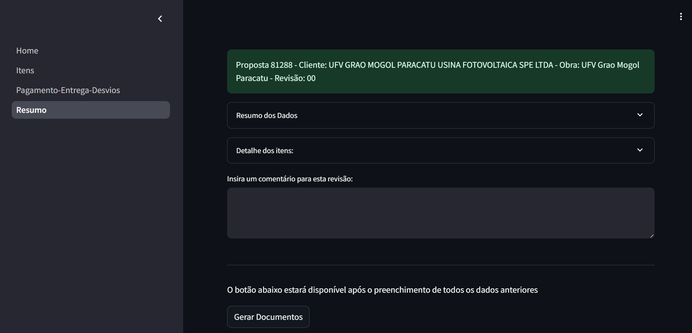

# Proposta Automatizada para Solar
Esta seção descreve como criar uma proposta automatizada para sistemas fotovoltaicos. Esta divisão de equipamentos se refere aos SKIDs (subestações compactas para conexão à rede) e QGBTs (quadros de distribuição de baixa tensão), além dos componentes associados como inversores, módulos solares e estruturas de montagem.

## Acessando a tela de criação de proposta

Identifique a linha correspondente na tela principal de propostas, clique na linha e selecione na tela de ações a opção de "Revisão". Abrirá a listagem de revisões e selecione a opção "Configurar Proposta" se não possuir nenhuma revisão autmatizada. Caso possua clique no ícone na linha de revisão "Revisar no aplicativo".

## Navegação
Ao abrir a tela de revisão, será exibida a tela de navegação, conforme a imagem abaixo. Abaixo segue a descrição das abas:

1.Home: Tela Inicial, apenas para visualização.

2.Itens: Principal tela do aplicativo, onde será configurado os itens da proposta. Bem como margens como margem de lucro, 
comissão, ICMS, etc.

3.Pagamento-Entrega-Desvios: Tela de configuração de pagamento, entrega e desvios.

4.Resumo:  Tela de resumo da proposta, onde é exibido os valores totais da proposta e os itens da proposta. Possui o botão de "Gerar Documentos" para gerar o WORD da proposta, PDF de extrato e salvar a proposta no banco de dados.

## Principais Campos e Parâmetros:

### Campos de Percentuais e Margens:

#### Configuração dos Percentuais

Estes campos são utilizados para definir os percentuais e margens para calculos de valores.

| Campo | Descrição |
|-------|-----------|
|Lucro| Percentual do lucro da proposta no formato ex 4,5%|
|ICMS| Percentual do ICMS no formato ex 12%|
|Comissão | Comissão do agente no formato ex 10%|
|Tipo de Frete| Seleção, pode ser "CIF" ou "FOB"|
|Local de Frete| Seleção, escolha entre a listagem|
|Frete| Percentual do frete no formato ex 10%|
|Cliente Contribuinte do ICMS?| Seleção, pode ser "Sim" ou "Não", caso for "Não" abrirá os campos "DIFAL" e "Fundo de Pobreza" que também deverão ser preenchidos no formato ex 10%|
|Valor do Dolar| Valor do dolar no formato ex 5,00|

#### Campos de Configurações da Usina:
| Campo | Descrição |
|-------|-----------|
|Quantas usinas terá a proposta?| Quantidade de usinas que serão adicionadas. Através deste campo que será adicionado ou removido usinas. |
|Nome da Usina| Nome da usina, campo de livre. Campo dentro de cada usina. |
|Quantos Itens terá a Usina?| Quantidade de itens que serão adicionados. Através deste campo que será adicionado ou removido itens. |
|Selecione o tipo de produto| Seleção, pode ser "SKID","QGBT","Inversor","Módulo","Logger","Estrutura","Cabine","Cabos"|

### Campos de Itens:

#### SKID:

| Campo | Descrição |
|-------|-----------|
|Quantidade| Quantidade de SKID que serão adicionados. Através deste campo que será multiplicado pelo valor do SKID|
|Potência (kVA)| Potência do SKID, campo de seleção variando de 500 a 3000. Atráves deste campo que será associado com o transformador|
|Transformador Auxiliar| Seleção, caso estiver como "Nenhum" não será adicionado o transformador auxiliar. Caso houver, selecione a potência dentro da listagem|
|Tensão MT (kV)| Tensão do transformador, campo de seleção 15 ou 36. Atráves deste campo que será associado com o transformador|
|Configuração MT| Seleção, pode ser PR (Para-raio), CH (Chave seccionadora) ou NA (Não aplicável)|
|Configuração BT| Seleção, pode ser PR (Para-raio) ou CH (Chave seccionadora)|
|Tensão na BT| Seleção, pode ser 600 ou 800V|
|Fator K| Seleção, varia entre 1 a 13, causa impacto no valor do transformador|
|Descrição do valor adicional| Campo de livre. Campo que não contenha nos produtos|
|Valor adicional| Campo de livre. Campo que não contenha nos produtos|

#### QGBT:

| Campo | Descrição |
|-------|-----------|
|Quantidade| Quantidade de QGBT que serão adicionados. Através deste campo que será multiplicado pelo valor do QGBT|
|Potência (kVA)| Potência do QGBT, campo de seleção variando de 100 a 3000.|
|Tensão BT| Seleção, pode ser 600 ou 800V|
|Configuração BT| Seleção, pode ser PR (Para-raio) ou CH (Chave seccionadora)|
|Transformador Auxiliar| Seleção, caso estiver como "Nenhum" não será adicionado o transformador auxiliar. Caso houver, selecione a potência dentro da listagem|

#### Transformador Isolado a Seco:

| Campo | Descrição |
|-------|-----------|
|Quantidade| Quantidade de transformadores que serão adicionados. Através deste campo que será multiplicado pelo valor do transformador|
|Descrição| Seleção, campo concatenado que já contém a potência, classe de tensão e perdas.|
|Fator K| Seleção, varia entre 1 a 13, causa impacto no valor do transformador|

#### Inversor:

| Campo | Descrição |
|-------|-----------|
|Quantidade| Quantidade de inversores que serão adicionados. Através deste campo que será multiplicado pelo valor do inversor|
|Fabricante| Seleção, empresa que fabrica o inversor|
|Modelo| Seleção, modelo do inversor|
|Fator de importação| Campo livre,  vem pre-setado com o valor recomendado, mas pode ser ajustado para impactar no preço.|
|Valor Adicional| Campo de livre. Campo que não contenha nos produtos|

#### Logger:

| Campo | Descrição |
|-------|-----------|
|Quantidade| Quantidade de loggers que serão adicionados. Através deste campo que será multiplicado pelo valor do logger|
|Fabricante| Seleção, empresa que fabrica o logger.|
|Modelo| Seleção, modelo do logger|
|Fator de importação| Campo livre,  vem pre-setado com o valor recomendado, mas pode ser ajustado para impactar no preço.|
|Valor Adicional| Campo de livre. Campo que não contenha nos produtos|

#### Módulo:

| Campo | Descrição |
|-------|-----------|
|Quantidade| Quantidade de módulos que serão adicionados. Através deste campo que será multiplicado pelo valor do módulo|
|Modelo| Seleção, modelo do módulo (se refere a potência do módulo)|
|Tipo| Campo livre para adicionar especificações do módulo|
|Marca| Seleção, empresa que fabrica o módulo|
|Valor adicional| Campo de livre. Campo que não contenha nos produtos|
|Frete adicional| Campo de livre. Campo que não contenha nos produtos|

#### Estrutura:
| Campo | Descrição |
|-------|-----------|
|Quantidade| Quantidade de estruturas que serão adicionadas. Através deste campo que será multiplicado pelo valor da estrutura|
|Tipo| Seleção, pode ser "Fixa" ou "Tracker"|
|Modelo| Seleção, modelo da estrutura. Pode ser "Simples","Média" ou "Robusta"|
|Marca| Seleção, empresa que fabrica a estrutura|
|Potência da Usina em Wp| Campo livre, digite qual é a potência da usina. Este campo só é habilitado caso a proposta não contenha módulos, caso contenha o sistema calcula automaticamente a potência da usina|

### Cabos:

| Campo | Descrição |
|-------|-----------|
|Quantidade| Quantidade de cabos que serão adicionados. Através deste campo que será multiplicado pelo valor do cabo|
|Metragem| Metragem do cabo|
|Segmento de Cabo| Seleção, pode ser "MT" , "BT" "Solar" |
|Modelo| Seleção, modelo do cabo|
|Marca| Seleção, empresa que fabrica o cabo|
|Valor do metro| Campo livre, pre-setado com o valor recomendado, mas pode ser ajustado para impactar no preço.|

### Cabine:

| Campo | Descrição |
|-------|-----------|
|Quantidade| Quantidade de cabines que serão adicionadas. Através deste campo que será multiplicado pelo valor da cabine|
|Classe de tensão| Seleção, pode ser 15 ou 36|
|Número de Medições| Seleção, pode ser 1, 2 ou 3|
|Fornecedor| Campo de seleção, pode ser Blutrafos ou Outros|

## Rotina para Configurar Itens na Proposta Automatizada:

1.Na listagem de proposta identifique a linha desejada, clique na linha e aperte em "Revisões". Caso não tenha revisão aperte no botão "Configurar Proposta".  

2.Na aba do aplicativo utilize a navegação lateral e vá para "Itens".

3.Configure os percentuais e margens.

4.Digite o número de usinas. Para apagar uma usina diminua o valor.

5.Digite o nome da usina, pode ser deixado em branco. 

6.Selecione quantos itens terá a usina. Para apagar um item diminua o valor.

7.Selecione qual tipo de produto para cada campo que está sendo adicionado.

8.Para cada aba expansível de itens, preencha os campos de acordo com o produto. Descrição de cada campo detalhada no tópico anterior.

## Cálculo:

## Configuração de Prazos de Entrega e Eventos de Pagamento

Estes são as configurações finais da proposta. Após configurar os itens navegue pelo menu lateral para "Entrega/Pagamento/Desvios" e configure os prazos de entrega e os eventos de pagamento.

## Prazos Gerais

Possui um campo para configurar o prazo para o cliente aprovar o desenho, campo para a engenharia entregar o desenho e um campo para o prazo de fabricação do equipamento. Possui um campo de livre digitação para configurar como desejar, caso queira incluir mais uma linha clique em "Adicionar Prazo".

## Eventos

São condições únicas para cada  tipo de equipamentos. Possui 3 campos: Percentual a pagar, diaas para pagamento e evento de pagamento relacionado. 
Os eventos podem ser adicionados ou excluidos, porém é verificado se os percentuais são iguais a 100%.

## Desvios

É um campo livre para informar qualquer desvio que está sendo considerado na proposta.

## Finalização da Proposta

Navegue até a aba "Resumo". Nela apareção o resumo dos itens selecionados e um campo para comentário geral da proposta. Após isso clique em "Gerar Documentos" o sistema irá gerar a proposta em WORD e a proposta em PDF (Extrato de resumo). Clique para fazer o download do arquivo e salve na pasta da rede de sua empresa.

