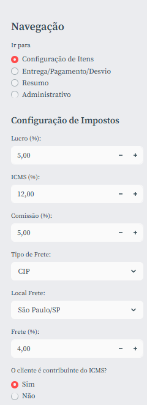
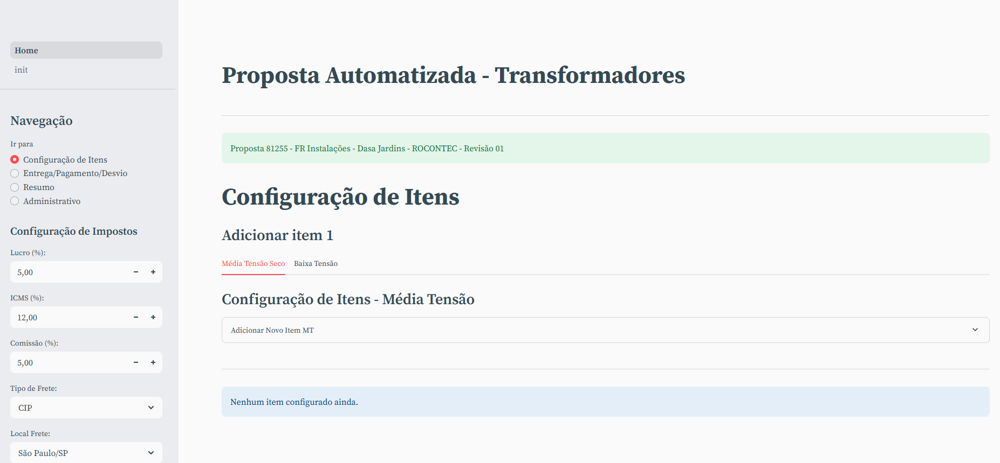
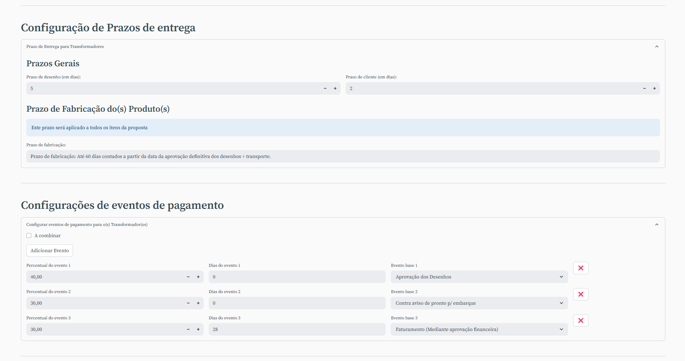
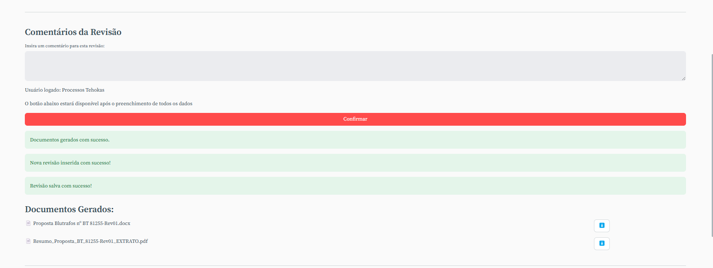

# Proposta Automatizada para Transformadores
Esta seção descreve como criar uma proposta automatizada para transformadores. Esta divisão de transformadores se refere aos transformadores que são vendidos pela empresa que não possuem composto de itens de revenda e componentes solares.

## Acessando a tela de criação de proposta

Identifique a linha correspondente na tela principal de propostas, clique na linha e selecione na tela de ações a opção de "Revisão". Abrirá a listagem de revisões e selecione a opção "Configurar Proposta" se não possuir nenhuma revisão autmatizada. Caso possua clique no ícone na linha de revisão "Revisar no aplicativo".

## Principais Campos e Parâmetros:

### Campos de Percentuais e Margens:

Estes campos são utilizados para definir os percentuais e margens para calculos de valores.

| Campo | Descrição |
|-------|-----------|
|Lucro| Percentual do lucro da proposta no formato ex 4,5%|
|ICMS| Percentual do ICMS no formato ex 12%|
|Comissão | Comissão do agente no formato ex 10%|
|Tipo de Frete| Seleção, pode ser "CIF" ou "FOB"|
|Local de Frete| Seleção, escolha entre a listagem|
|Frete| Percentual do frete no formato ex 10%|
|Cliente Contribuinte do ICMS?| Seleção, pode ser "Sim" ou "Não", caso for "Não" abrirá os campos "DIFAL" e "Fundo de Pobreza" que também deverão ser preenchidos no formato ex 10%|

## Campos de Transformadores de Média Tensão a Seco:
| Campo | Descrição |
|-------|-----------|
|Descrição| Lista de pesquisa para selecionar o transformador com pontência, classe de tensão e perdas. Por meio deste campo simplificado é capturado as informações acima|
|Fator K| Fator de correção de temperatura, deve ser selecionado na listagem|
|Tensão Primária| Tensão primária do transformador, campo de livre, não necessário o preenchimento da unidade|
|Tensão Secundária| Tensão secundária do transformador, campo de livre, não necessário o preenchimento da unidade|
|IP| Grau de Proteção da caixa, se tiver, pode ser 00,21 ou 54|
|Derivações| Campo de livre, não necessário o preenchimento da unidade|
|NBI| Campo de livre, não necessário o preenchimento da unidade. De acordo com a classe de tensão o sistema invere um valor|
|Quantidade| É a quantidade do item que está sendo adicionado|

## Acessórios para Transformadores de Média Tensão a Seco:

Os acessórios são configurados para cada item, basta selecionar o checkbox:

| Campo | Descrição |
|-------|-----------|
|Conjunto de 3 Buchas Plug in| Acrescenta um valor fixo no item|
| Sensor PT 100| Acrescenta um valor fixo no item|
|Relé: NT935-AD| Acrescenta um valor fixo no item|
|Relé: NT935-ETH| Acrescenta um valor fixo no item|
|Kit VP p/ TT de 15kVA a 3000kVA| Acrescenta um valor fixo no item|
|Flange AT até 15Kv (S/ barramentos)|Acrescenta um valor fixo no item|
|Flange BT até 800V (S/ barramentos)| Acrescenta um valor fixo no item|
|Ensaio de Elevação de Temperatura| Acrescenta um valor fixo no item|
|Ensaio de Tensão Suportável Nominal no Impulso| Acrescenta um valor fixo no item|
|Ensaio de Nível de Tensão de Rádio Interferência| Acrescenta um valor fixo no item|
|Ensaio de Nível de Ruído| Acrescenta um valor fixo no item|
|Descarga| Acrescenta um valor fixo no item|
|Barra de Alumínio p/ Flange| Acrescenta um percentual no item|
|Frequência de 50hz| Acrescenta um percentual no item|
|Trafo Religável com +1 tensão na BT| Acrescenta um percentual no item|
|Duplo Secundário| Acrescenta um percentual no item|
|Para tap's até 10,2kV| Acrescenta um percentual no item|
|Blindagem eletrostática| Acrescenta um percentual no item|

## Rotina para Configurar um item de Transformador de Média Tensão a Seco na Proposta Automatizada:

1.Configure os percentuais e impostos na aba lateral na mesma tela. 

2.Após ser redirecionado para a janela de criação de propostas verifique no canto superior se o número e o cliente correspondem a revisão que deseja criar. 

3.A primeira dela é a tela de configuração dos itens. Primeiro selecione a aba que corresponde ao tipo de item que deseja adicionar, neste caso é "Transformador de Média Tensão a Seco".

4.Selecione a descrição do transformador que deseja adicionar, o sistema irá preencher os campos de tensão primária, secundária, derivações e NBI.

5.Complete os demais campos de acordo com a necessidade.

6.Marque ou desmarque os acessórios que deseja adicionar.

7.Clique em "Adicionar Item" para adicionar o item na proposta.

## Campos de Transformadores de Baixa Tensão a Seco:

| Campo | Descrição |
|-------|-----------|
|Descrição| Lista de pesquisa para selecionar o transformador com pontência. Por meio deste campo simplificado é capturado as informações acima|
|Fator K| Fator de correção de temperatura, deve ser selecionado na listagem|
|Tensão Primária| Tensão primária do transformador, campo de livre, não necessário o preenchimento da unidade|
|Tensão Secundária| Tensão secundária do transformador, campo de livre, não necessário o preenchimento da unidade|
|Material| Seleção, pode ser Cobre ou Alumínio|
|Quantidadee| É a quantidade do item que está sendo adicionado|

## Acessórios para Transformadores de Baixa Tensão a Seco:

Os acessórios são configurados para cada item, basta selecionar o checkbox:

| Campo | Descrição |
|-------|-----------|
|Frequência de 50hz| Acrescenta um percentual no item|
|Blindagem eletrostática| Acrescenta um percentual no item|
|Ensaio de Elevação de Temperatura| Acrescenta um valor fixo no item|
|Ensaio de Nível de Ruído| Acrescenta um valor fixo no item|
|Relé| Seleção, pode ser TH104, NT935-AD ou NT935-ETH|
|Taps| Seleção, pode ser 2 taps ou 3taps|
|Tensões| Pode ser 2 tensões ou 3 tensões|

## Rotina para Configurar um item de Transformador de Baixa Tensão a Seco na Proposta Automatizada:

1.Configure os percentuais e impostos na aba lateral na mesma tela.
2.Após ser redirecionado para a janela de criação de propostas verifique no canto superior se o número e o cliente correspondem a revisão que deseja criar.
3.A primeira dela é a tela de configuração dos itens. Primeiro selecione a aba que corresponde ao tipo de item que deseja adicionar, neste caso é "Transformador de Baixa Tensão a Seco".

4.Selecione a descrição do transformador que deseja adicionar, o sistema irá preencher os campos de tensão primária, secundária, derivações.
5.Complete os demais campos de acordo com a necessidade.
6.Marque ou desmarque os acessórios que deseja adicionar.
7.Clique em "Adicionar Item" para adicionar o item na proposta.

OBS: É possível adicionar itens de média e baixa tensão na mesma proposta. Gera uma proposta "unificada".

## Configuração de Prazos de Entrega e Eventos de Pagamento

Estes são as configurações finais da proposta. Após configurar os itens navegue pelo menu lateral para "Entrega/Pagamento/Desvios" e configure os prazos de entrega e os eventos de pagamento.

## Parâmetros para configuração de Prazos de Entrega e Eventos de Pagamento

## Prazos Gerais

Possui um campo para configurar o prazo para o cliente aprovar o desenho, campo para a engenharia entregar o desenho e um campo para o prazo de fabricação do equipamento.

## Eventos

São condições únicas para ambos os tipos de equipamentos. Possui 3 campos: Percentual a pagar, diaas para pagamento e evento de pagamento relacionado. 
Os eventos podem ser adicionados ou excluidos, porém é verificado se os percentuais são iguais a 100%.

## Desvios

É um campo livre para informar qualquer desvio que está sendo considerado na proposta.

## Finalização da Proposta

Navegue até a aba "Resumo". Nela apareção o resumo dos itens selecionados e um campo para comentário geral da proposta. Após isso clique em "Confirmar" o sistema irá gerar a proposta em WORD. Clique para fazer o download do arquivo e salve na pasta da rede de sua empresa.

