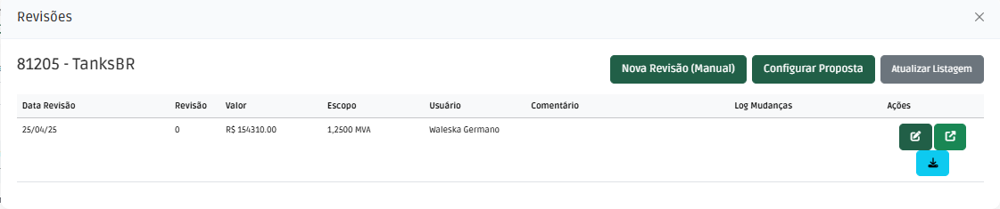
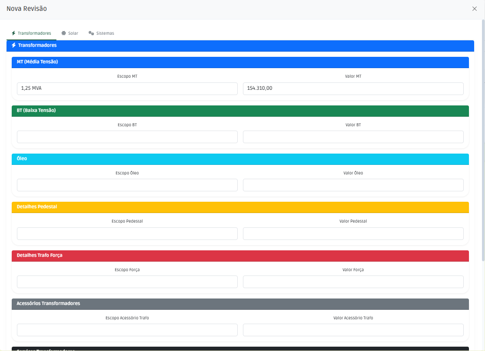

# Revisão de Propostas

Esta seção detalha o processo para criar e gerenciar revisões de propostas existentes, permitindo ajustes no escopo e nos valores ofertados.

## Acessando a Tela de Revisão

O processo para iniciar uma revisão é semelhante ao de edição:

1.  **Acesse a Lista:** Navegue até a lista principal de propostas no sistema.
     

2.  **Selecione a Proposta:** Localize a proposta que deseja revisar e clique na linha correspondente.

3.  **Abra as Ações:** Esta ação abrirá a tela de ações da proposta. Clique na opção "Revisão" (ou similar).
     

4.  **Tela de Revisões:** Você será direcionado para a tela que lista as revisões existentes (se houver) e oferece opções para criar uma nova.

## Criando uma Revisão Manual

A opção "Revisão Manual" permite que você insira diretamente os detalhes de escopo e valor da nova revisão. Os campos disponíveis variam conforme o **Tipo** da proposta original.

 <!-- **Sugestão:** Adicione um print desta tela -->
 <!-- **Sugestão:** Adicione um print desta tela -->

### Campos por Tipo de Proposta:

#### 1. Transformadores (Tipos: B, F, O, P, S)

Para propostas cujo tipo principal seja um transformador:

| Campo   | Descrição                               |
| :------ | :-------------------------------------- |
| Escopo  | Potência do equipamento (ex: kVA, MVA). |
| Valor   | Valor total ofertado para o item.       |

#### 2. Solar (Tipos: Solar GD, Solar GC)

Propostas de energia solar possuem uma estrutura mais detalhada:

| Campo                     | Descrição                                                                                                                               |
| :------------------------ | :-------------------------------------------------------------------------------------------------------------------------------------- |
| Escopo Solar (Blutrafos)  | Potência total (ex: kWp, MWp) dos equipamentos fornecidos diretamente pela Blutrafos.                                                    |
| Valor Solar (Blutrafos)   | Valor correspondente aos itens fornecidos diretamente pela Blutrafos.                                                                     |
| Tipo Solar                | Indica se a proposta inclui apenas itens Blutrafos (`Skid`) ou também itens de revenda/parceiros (`KIT`).                                   |
| **Itens de Revenda (KIT)**| Se `Tipo Solar` for `KIT`, os campos abaixo devem ser preenchidos para cada componente de revenda incluído:                               |
| *Inversor*                | Marca, Potência (ex: kW), Valor Unitário, Quantidade.                                                                                   |
| *Módulos*                 | Marca, Potência (ex: Wp), Valor Unitário, Quantidade.                                                                                   |
| *Estrutura*               | Marca, Modelo (ex: Solo, Telhado), Valor Total.                                                                                         |
| *Cabos*                   | Marca/Tipo, Valor Total.                                                                                                                |
| *Cabine/Subestação*       | Concessionária (se aplicável), Potência (ex: kVA), Valor Total.                                                                         |

!!! info "KIT vs Skid"
    Uma proposta é considerada **KIT** se incluir qualquer item de revenda (Inversor, Módulos, Estrutura, Cabos, Cabine de parceiros). Caso contrário, se todos os componentes principais forem fornecidos pela Blutrafos, é classificada como **Skid**.

#### 3. Sistema (Tipos: SE, PMT, QE, PE, EL, Outros)

Para outros tipos de propostas focadas em sistemas ou painéis:

| Campo   | Descrição                                     |
| :------ | :-------------------------------------------- |
| Escopo  | Descrição geral do sistema ou painel ofertado. |
| Valor   | Valor total ofertado para o sistema/painel.   |

### Campo Comum

| Campo       | Descrição                                                                 |
| :---------- | :------------------------------------------------------------------------ |
| Observações | Campo livre para adicionar notas, justificativas ou detalhes da revisão. |

## Salvando a Revisão

Após preencher todos os campos relevantes para o tipo de proposta e a natureza da revisão (manual), clique no botão "Salvar" (ou similar) para registrar a nova revisão. A proposta original será atualizada para refletir os valores e o escopo desta última revisão.

---

## Criando Revisão Automátizadas

O botão de "Configurar Proposta" permite a criação de revisões automáticas com base em regras predefinidas e tem como saída  proposta formatada em word e um extrato em pdf.

No momento é possível criar revisões automáticas para as propostas de Média Tensão a Seco (S), Baixa Tensão a Seco (B) e propostas Solares (Solar GD e Solar GC).

Para acessar o manual de Propostas Automatizadas para Transformadores ( Média Tensão a Seco (S) e  Baixa Tensão a Seco (B) ) clique [aqui](proposta_trafo.md).

Para acessar o manual de Propostas Automatizadas para Solar (Solar GD e Solar GC) clique [aqui](proposta_solar.md).
