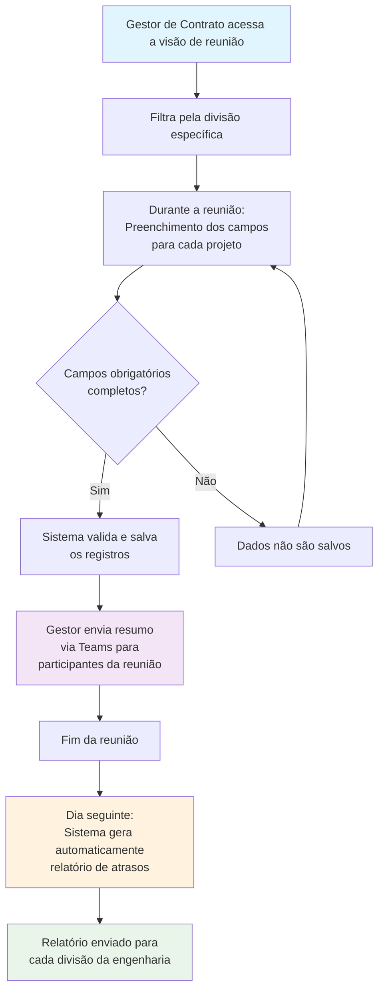

# Tabela-resumo
| Categoria             | Detalhe                                      |
| :-------------------- | :------------------------------------------- |
| **Nome da Empresa:** | Tehokas                                      |
| **Empresa Destino:** | Blutrafos                                    |
| **Criador:** | Eduardo Poli                               |
| **Data Elaboração:** | 05/06/2025                                   |
| **Departamento Dest.:**| GC , PCP , Engenharia e Financeiro                           |
| **Tarefa Destino:** | Consulta de dados                       |
| **Versão:** | 1.0                                          |
| **Prazo Revisão:** | 05/07/2025                                   |

---

Bem-vindo à documentação da Tabela-resumo do TrackFlow. Esta ferramenta foi desenvolvida para consolidar informações de múltiplas tabelas em uma única interface interativa, oferecendo uma consulta personalizada e objetiva de acordo com o usuário.

## Índice

* [Objetivos e Benefícios](#objetivos-e-benefícios)
* [Ciclo de Atualizações](#ciclo-de-atualizações)
* [Sistema de Preferências do Usuário](#sistema-de-preferências-do-usuário)
* [Interface da Tabela](#interface-da-tabela)
* [Navbar](#navbar)
* [Parâmetros e Filtros](#parâmetros-e-filtros)
* [Sistema de Comentários](#sistema-de-comentários)
* [Recursos de Filtragem](#recursos-de-filtragem)
* [Guia de Utilização](#guia-de-utilização)
* [Reunião](#reunião)

## Objetivos e Benefícios

A Tabela-resumo foi desenvolvida para atender a dois objetivos principais:

1. **Melhorar a experiência do usuário**
>    * Unificar a consulta de diferentes setores em um só ambiente.
>    * Interface intuitiva e interativa
2. **Expandir a funcionalidade**
   >* Adição de parâmetros avançados não disponíveis em tabelas Excel convencionais
   >* Salvamento automático das preferências do usuário
   >* Sistema de comentários integrado para documentação de reuniões

## Ciclo de Atualizações

Os dados da Tabela-resumo são atualizados automaticamente sete vezes ao dia:

* **07:30**
* **09:30**
* **11:30**
* **13:30**
* **15:30**
* **17:30**
* **19:30**

## Sistema de Preferências do Usuário

A Tabela-resumo salva as configurações definidas pelo usuário, fazendo assim com que não necessite filtrar diversas vezes. Garantindo uma melhor experiência para o usuário.

### O que é salvo automaticamente

* **Seleção de colunas**: As colunas que o usuário optou por exibir ou ocultar
* **Ordenação**: A ordem personalizada das colunas definida pelo usuário
* **Posicionamento**: A posição de cada coluna na tabela após movimentação
* **Parâmetros específicos**: Seleções como "Meus Projetos" e "Status Projeto"

### Persistência de configurações

* As preferências são mantidas mesmo após o usuário encerrar a sessão
* Ao fazer login novamente, todas as configurações personalizadas são restauradas
* A experiência do usuário é preservada entre sessões, eliminando a necessidade de reconfigurar a tabela

### Reorganização e movimentação

* O usuário pode arrastar e soltar colunas para reorganizá-las
* A nova ordem é salva automaticamente nas preferências
* A tabela pode ser completamente personalizada de acordo com as necessidades específicas de cada usuário

## Interface da Tabela

A interface da Tabela-resumo é composta por elementos projetados para melhor usabilidade.

## Navbar

A barra de navegação superior contém os seguintes elementos:

### Card de Valor Total

**Função**: Exibe informações financeiras e quantitativas em tempo real

**Componentes**:
  * Soma do campo "valor_total_item" para todas as linhas visíveis
  * Contador de linhas exibidas atualmente

**Comportamento dinâmico**:
  * Atualiza automaticamente quando filtros são aplicados
  * Reflete apenas os valores das linhas que atendem aos critérios de filtragem
  * Funciona como um dashboard financeiro em tempo real

### Botão de Parâmetros

**Função**: Abre o menu de configuração de parâmetros

**Seções disponíveis**:

  * Geral
  * GC (Gestão de Contratos)

**Detalhamento**: Consulte a seção [Parâmetros e Filtros](#parâmetros-e-filtros) para informações completas

### Botão Exportar Excel

**Função**: Exporta os dados visíveis para um arquivo Excel

**Comportamento**:

  * Exporta apenas as linhas que estão atualmente visíveis na tabela
  * Respeita todos os filtros aplicados
  * Mantém a formatação e ordenação das colunas conforme exibidas na interface

**Casos de uso**:

  * Exportação seletiva (ex: apenas projetos BxBx com status aberto)
  * Exportação da tabela completa (sem filtros aplicados)
  * Criação de relatórios personalizados com base em critérios específicos

### Botão Configurar Colunas

**Função**: Permite personalizar quais colunas são exibidas na tabela

**Interface**:

  * Painel com checkbox para cada coluna disponível
  * Opção para selecionar todas as colunas de uma vez
  * Opção para deselecionar todas as colunas

**Recursos adicionais**:

  * Botão "Reordenação Padrão" que restaura a ordem original das colunas
  * Salvamento automático das preferências
  * Visualização imediata das alterações

### Botão Limpar Filtros

**Função**: Remove todos os filtros aplicados na tabela

**Comportamento**:

  * Restaura a visualização completa dos dados
  * Atualiza o Card de Valor Total para refletir todas as linhas
  * Mantém as preferências de colunas e ordenação

### Botão do Usuário

**Função**: Identifica o usuário logado e permite acesso às funções de conta

**Exibição**: Mostra o primeiro nome do usuário atualmente logado

**Ações disponíveis**:
  * Clique para deslogar da conta
  * Identificação visual rápida do usuário ativo

## Parâmetros e Filtros

O sistema de parâmetros permite configurações rápidas e pré-definidas da tabela. Acessível através do botão "Parâmetros" na navbar.

### Seção Geral

#### Parâmetro Visão Geral

**Função**: Configura a tabela com um conjunto predefinido de colunas essenciais

**Colunas exibidas quando ativado**:

  * ID
  * Divisão
  * Tipo Produto
  * Gestor
  * OV
  * OP
  * Cliente
  * Obra
  * Desc Produto
  * Qtde
  * Etapa
  * Dt Etapa
  * Status Etapa
  * Dt Operacional
  * Dt Contratual
  * Dt Repac

**Comportamento especial**:

  * Não é salvo nas preferências do usuário
  * Ao desativar, restaura a configuração anterior de colunas
  * Funciona como uma visualização temporária sem afetar configurações salvas

### Seção GC (Gestão de Contratos)

#### Parâmetro Meus Projetos

* **Função**: Filtra a tabela para mostrar apenas os projetos do gestor logado
* **Comportamento**:
>  * Identifica automaticamente o usuário logado
>  * Filtra os registros onde o campo "gestor" corresponde ao usuário atual
* **Salvamento**:
>  * Pode ser salvo nas preferências do usuário
>  * Se salvo, será aplicado automaticamente em futuros acessos

#### Parâmetro Status Projeto

 **Função**: Filtra projetos pelo seu status atual
 
 **Opções disponíveis**:

  * Abertos
  * Fechados
  * Suspensos
 
 **Salvamento**:

  * Pode ser salvo nas preferências do usuário
  * Se salvo, a seleção será mantida em sessões futuras

#### Parâmetro Reunião

 **Função**: Filtra projetos por divisão da engenharia.

 **Opções disponíveis**:

  * BxBx
  * Seco
  * Óleo
  * Eng Ele
  * Eng Mec
  * Service

 **Caso de uso**:

  * Visualização rápida de projetos específicos para reuniões
 
 **Comportamento especial**:

  * Não é salvo nas preferências do usuário
  * Funciona como filtro temporário

## Sistema de Comentários

O sistema de comentários permite aos gestores documentar informações importantes discutidas em reuniões.

### Acesso e Ativação

* **Botão Carregar Comentários**: Localizado abaixo da navbar
* **Comportamento**: Ao clicar, carrega as colunas de comentários na tabela

### Colunas de Comentários

* **Etapa**: Registro da etapa discutida na reunião
* **Setor Responsável**: Identificação do setor responsável pela ação
* **Dt Etapa Alinhada**: Data acordada para conclusão da etapa
* **Comentário**: Texto livre para informações adicionais

### Permissões e Restrições

 **Permissão de edição**:

  * Exclusiva para gestores da Gestão de Contratos 
  * Usuários sem nível de acesso apropriado recebem mensagem de erro ao tentar salvar
  * Sistema verifica automaticamente o nível de acesso do usuário

### Regras de Salvamento

* **Grupo Etapa, Setor e Data**:
>  * As três colunas devem ser preenchidas em conjunto
>  * Não é possível salvar apenas uma ou duas destas colunas
>  * Se as três estiverem preenchidas, todas são salvas
>  * Se as três estiverem vazias em um registro que já possuía valores, os dados serão apagados do banco

* **Coluna Comentário**:
>  * Pode ser salva independentemente
>  * Pode ser salva junto com o grupo Etapa/Setor/Data
>  * Pode ser apagada deixando o campo vazio

### Funcionalidade de Edição

* **Processo**:
>  * Gestores podem editar campos já preenchidos
>  * Alterações são salvas no banco de dados
>  * Apagar todos os campos resulta na remoção do registro

## Recursos de Filtragem

A Tabela-resumo oferece recursos avançados de filtragem em todas as colunas.

### Filtros de Texto

* **Ordenação alfabética**: A-Z ou Z-A
* **Pesquisa**: Filtragem por texto contido no campo
* **Exclusão**: Possibilidade de excluir determinados valores

### Filtros de Números

* **Ordenação numérica**: Crescente ou decrescente
* **Intervalos**: Definição de valores mínimos e máximos
* **Valores específicos**: Seleção de valores exatos

### Filtros de Data

* **Nível de granularidade**: Filtros por ano, mês ou dia
* **Intervalos**: Seleção de períodos específicos
* **Datas específicas**: Seleção precisa de datas

### Comportamento dos Filtros

* **Efeito na visualização**: Apenas registros que atendem aos critérios são exibidos
* **Efeito no Card de Valor Total**: O valor total é recalculado com base nas linhas visíveis
* **Combinação**: Múltiplos filtros podem ser aplicados simultaneamente

## Guia de Utilização

### Configuração Inicial

1. Acesse a Tabela-resumo
2. Utilize o botão "Configurar Colunas" para selecionar as colunas relevantes
3. Organize as colunas na ordem desejada (arraste e solte)
4. As configurações serão salvas automaticamente

### Filtragem de Dados

1. Utilize os parâmetros na navbar para filtros pré-configurados
2. Aplique filtros específicos nas colunas conforme necessário
3. Observe o Card de Valor Total para visualizar o impacto dos filtros
4. Use o botão "Limpar Filtros" para remover todos os filtros aplicados

### Utilização de Comentários

1. Clique no botão "Carregar Comentários" para ativar as colunas de comentários
2. Preencha as informações relevantes:
>   * Para comentários sobre etapas: preencha Etapa, Setor Responsável e Dt Etapa Alinhada
>   * Para observações gerais: utilize apenas o campo Comentário
3. As alterações são salvas automaticamente no banco de dados
4. Apenas gestores da Gestão de Contratos podem editar comentários

### Exportação de Dados

1. Aplique os filtros desejados para selecionar os dados relevantes
2. Clique no botão "Exportar Excel"
3. O arquivo Excel será gerado contendo apenas os dados visíveis na tabela

## Reunião

A visão de reunião é uma funcionalidade desenvolvida para facilitar o alinhamento entre os gestores de contrato e as divisões da engenharia. Este módulo permite um gerenciamento dos projetos durante as reuniões de alinhamento de projetos.

### Objetivo

Facilitar a comunicação e o alinhamento entre a Gestão de Contratos e as diferentes divisões da Engenharia, garantindo que todas as etapas dos projetos sejam adequadamente coordenadas e documentadas.

### Divisões da Engenharia

Cada divisão possui seu próprio parâmetro de filtro específico:

* **BxBx**
* **Seco**
* **Óleo**
* **Eng Ele** (Engenharia Sistemas)
* **Eng Mec** (Engenharia Mecânica)
* **Service**

### Campos de Alinhamento

O sistema de reunião utiliza cinco campos principais para documentar os alinhamentos:

#### Campos Obrigatórios

* **Etapa**: Definição da etapa atual ou próxima do projeto. Utilizada como parâmetro para mudar a data prevista da etapa.
* **Setor da Engenharia**: Identificação da divisão responsável pela etapa.
* **Dt Alinhada**: Data acordada para conclusão da etapa ou data prevista para realizar alguma ação.

#### Campos Opcionais

* **Comentário**: Observações adicionais sobre o alinhamento
* **Apontar Data**: Funcionalidade para modificar a data da etapa

### Regras de Salvamento

**Campos obrigatórios em conjunto**:
>* Os três campos obrigatórios (Etapa, Setor da Engenharia e Dt Alinhada) devem ser preenchidos simultaneamente
>* O salvamento só ocorre quando os três campos estão completos
>* Se qualquer um dos três campos estiver vazio, nenhum dado será salvo

**Campo Comentário**:
>* Pode ser salvo independentemente dos campos obrigatórios
>* Não impede o salvamento dos demais campos

**Campo Apontar Data**:
>* Só é modificada a data prevista da etapa se a etapa atual é igual a etapa apontada e o campo apontar data estar marcado.
>* Funciona como ferramenta de ajuste de cronograma.

### Permissões de Acesso

**Usuários autorizados para salvamento**:

* Gestores de Contrato
* Programador PCP

**Restrições**:
>* Outros usuários podem visualizar os dados, mas não podem realizar alterações
>* Sistema verifica automaticamente as permissões antes de permitir salvamento

### Comunicação e Notificações

#### Compartilhamento no Teams

**Processo**:
>* Ao final da reunião, o gestor de contrato pode enviar um resumo do que foi alinhado
>* O envio é feito diretamente para o grupo do Teams correspondente à divisão
>* Todos os participantes da reunião recebem as informações simultaneamente
>* Para enviar este resumo vá para a aba "Comentários" no ribbon e clique em "Enviar (nome da divisão) para Teams." 

#### Automação de Atrasos

**Funcionamento**:
>* No dia seguinte à reunião, é gerada uma listagem automática
>* A listagem identifica projetos alinhados em atraso para cada divisão da engenharia
>* Cada divisão recebe apenas os atrasos relacionados aos seus projetos

### Fluxo de Trabalho

1. **Preparação**: Gestor de contrato acessa a visão de reunião e filtra pela divisão específica
2. **Alinhamento**: Durante a reunião, os campos são preenchidos para cada projeto discutido
3. **Salvamento**: Sistema valida e salva apenas registros com campos obrigatórios completos
4. **Comunicação**: Gestor envia resumo via Teams para todos os participantes
5. **Monitoramento**: Sistema gera relatório automático de atrasos no dia seguinte

