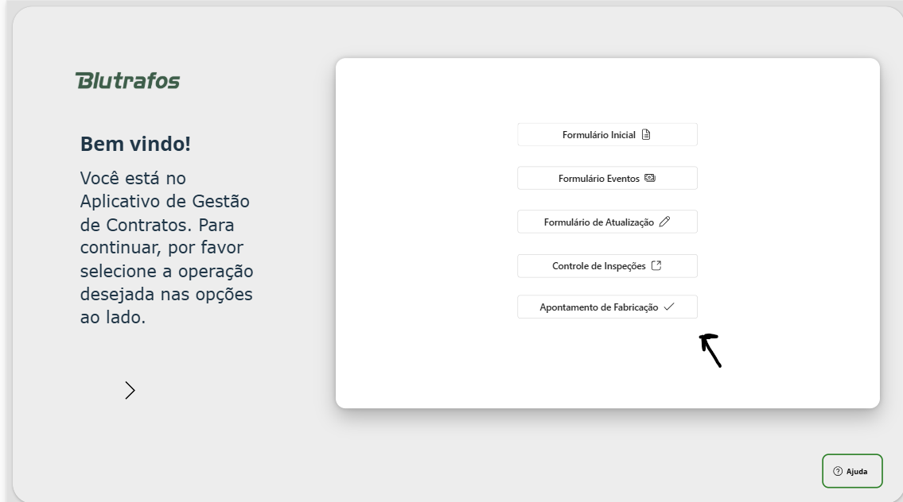
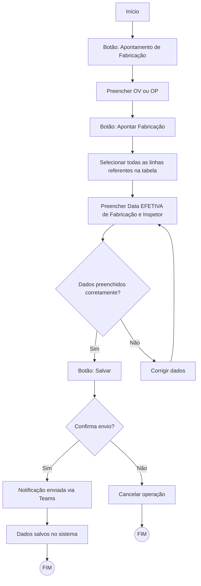
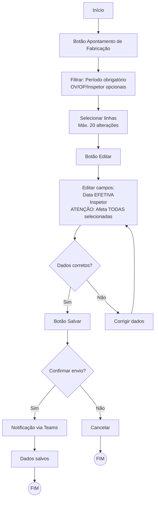

# Apontamento de Fabricação

## Introdução e Acesso

Para garantir a precisão da data efetiva de fabricação, foi desenvolvida esta integração exclusiva com os laboratórios da empresa.

A seção "Apontamento de Fabricação" (conforme ilustrado na imagem abaixo) é uma área restrita, acessível apenas às contas autorizadas dos laboratórios.

Como acessar:

1.Navegue até o menu principal.

2.Clique no botão correspondente.

## Rotina de Apontamento

### Rotina padrão para apontamento

Esta rotina refere-se ao apontamento padrão, ou seja, aquele que não há variáveis como erro de preenchimento ou erro de cadastros. Conforme ilustrado pelo fluxograma abaixo:

### Rotina de Correção de apontamento

Esta rotina refere-se a correção do apontamento. Devido a notificação anterior via TEAMS do apontamento, ao modificar quaisquer linhas enviará novamente uma notificação informando a alteração na data, por isso, deve-se evitar apontamentos erroneos. Abaixo o fluxograma de como realizar esta rotina:

### Observações:
 
 1. Atenção a operações em massa de alteração da Data EFETIVA de Fabricação. Verifique antes de todas as linhas conteem o mesmo inspetor e data de fabricação para alterar. O sistema deixa alterar apenas 20 linhas simultâneas para evitar sobrecarga e erros.
 2. Caso por algum motivo não encontrar a linha que procura aperte em 'Atualizar Dados'. Caso mesmo assim não encontrar entre em contato com os Gestores de Contratos para verificar preenchimento.