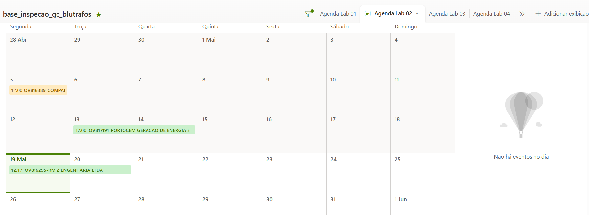

# Controle de Inspeções

## Introdução
Este painel integra o agendamento de inspeções com participação de clientes, oferecendo:

* Visualização clara de horários  
* Transparência para todas as partes  
* Acesso centralizado às informações  

> **Nota:** Ferramenta **apenas para visualização**. Para edições, contate os gestores de contratos.

Para acessar esta integração navegue pelo link abaixo e faça login com a conta da Blutrafos:
[link](https://solucoestehokas.sharepoint.com/sites/Blutrafos_GestoCompartilhada/Lists/base_inspecao_gc_blutrafos/Agenda%20Lab%2001.aspx?viewid=a9b1c8e9%2Da02e%2D4272%2Daa6f%2D3b415f0ebfd4)

## Funcionalidades

### Agenda

Conforme demonstrado na imagem acima é uma visão em formato de calendário.O usuário pode clicar em cima da inspeção para ver informações como: nome do cliente, equipamentos a serem testados, ov, op e ensaios. No momento foi desenvolvido 3 agendas para 3 laboratórios.

## Listagem

É possível modificar a visualização para lista. Por meio das abas na parte superior direita. É possível fazer filtros semelhante ao Excel e exportar a listagem. 