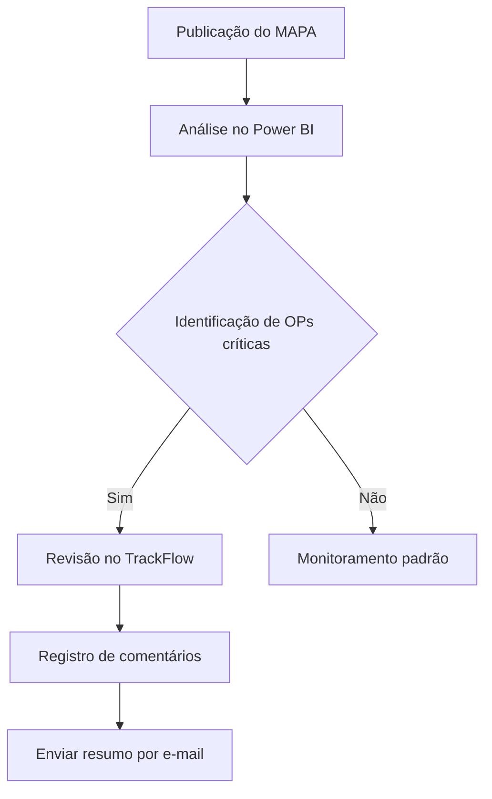

# Rotina de Análise do MAPA

## 1. Introdução
Esta documentação padroniza o processo de análise do MAPA para:
- Evitar erros decorrentes de atualizações em horários distintos
- Garantir consistência na interpretação dos dados
- Orientar usuários nas ferramentas disponíveis

### Ciclo de Publicação
| Componente          | Descrição                                      |
|---------------------|-----------------------------------------------|
| **Período de Elaboração** | Final da semana anterior              |
| **Vigência**        | Semana corrente                              |
| **Formato do Código** | `ANO-SSEMANA_ANTERIOR` (Ex: `2025-S25` vigente na semana 26) |

## 2. Ferramentas de Análise

### 2.1 Dashboard de Análise do MAPA
**Localização:**  
`PBI SMARTCENTER_BLUTRAFOS > GESTÃO DE PCP > ANÁLISE MAPA`

**Funcionalidades:**
- Visualização dos [indicadores descritos](analise_mapa.md) com granularidade por faixas:
  - Variações ≥5 dias
  - Variações ≥30 dias
  - Outros thresholds configuráveis

**Interatividade:**
1. Clique em qualquer gráfico para filtrar a tabela detalhada
2. Exporte dados via menu de contexto (⋯ > "Exportar dados")

### 2.2 TrackFlow - Visão para Reuniões
**Acesso:**
1. Navegue para `TABELA RESUMO`
2. Selecione `Parâmetros > Reunião MAPA`

**Recursos Especiais:**

| Função               | Descrição                                      | Localidade| 
|----------------------|-----------------------------------------------| ---| 
| **Comentários**      | Disponível para usuários autorizados          | Dentro da tabela principal |
| **Distribuição por Status** | Filtros pré-configurados para "DATA NÃO ATENDE" e "REPROGRAMADOS" | Aba "Mapa" |
| **Envio por E-mail** | Envie resumos diretamente para stakeholders   | Aba "Mapa" | 

## 3. Fluxo Recomendado
